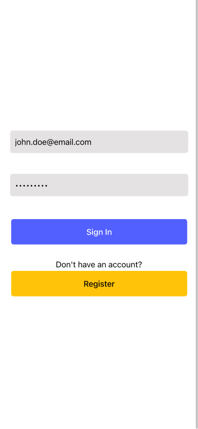

# **Description:**

Ionic-todos is an Ionic app developed for educational purposes to practice using the [Ionic framework](https://ionicframework.com/). The application's aim is to help users organize their tasks by tracking them and marking completed tasks

> **NOTE:** This application relies on a Backend API which you can find here: [Todos Backend API](https://github.com/FlavioVizza/ws-node-todos)

# **Features:**

- **Login**: Access your todo list using email and password
- **Register** a new account: create a new account specifying username, email, and password

- Through the **todo list page**, users can view their list of todo items

- Through the **todo detail page**, users can:
  - **Create Todo** items: Add new tasks to the todo list with title and description.
  - **Update Todo** items: Modify the status, title, and description of a to-do item through the detail page
  - **Delete Todo** items: Delete an existing Todos item through the detail page

- Through the **settings page**, users can:
  - Choose the **UI theme**: Choose between light or dark theme
  - Change **language** (currently available only in English and Italian)
  - **Log out**

<div style="display: flex; justify-content: center;">
    
    
    
    
    
    
</div>

# Technologies Used:

* Native runtime: Capacitor
* UI toolkit: Ionic
* JavaScript Framework: Angular

# System Requirements

```
System:
   NodeJS : v20.12.0
   npm    : 10.5.0

Ionic:
   Ionic CLI                     : 7.2.0
   Ionic Framework               : @ionic/angular 8.0.1
   @angular-devkit/build-angular : 17.3.6
   @angular-devkit/schematics    : 17.3.6
   @angular/cli                  : 17.3.6
   @ionic/angular-toolkit        : 11.0.1

Capacitor:
   Capacitor CLI      : 6.0.0
   @capacitor/android : 6.0.0
   @capacitor/core    : 6.0.0
   @capacitor/ios     : 6.0.0

Utility:
   native-run  : 2.0.1
```
   
# Installation:

1. Clone the repository to your local machine.
2. Open the project in VSCode.
3. Add the base URL of the Todos API in the environment file.
4. [Run the application](./docs/wiki/README.md) in a browser, emulator/simulator or phisical device. 🚀


